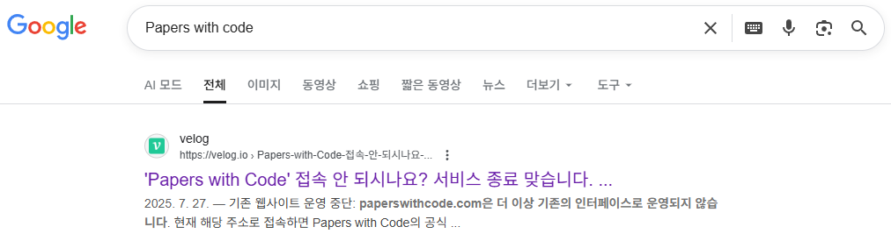
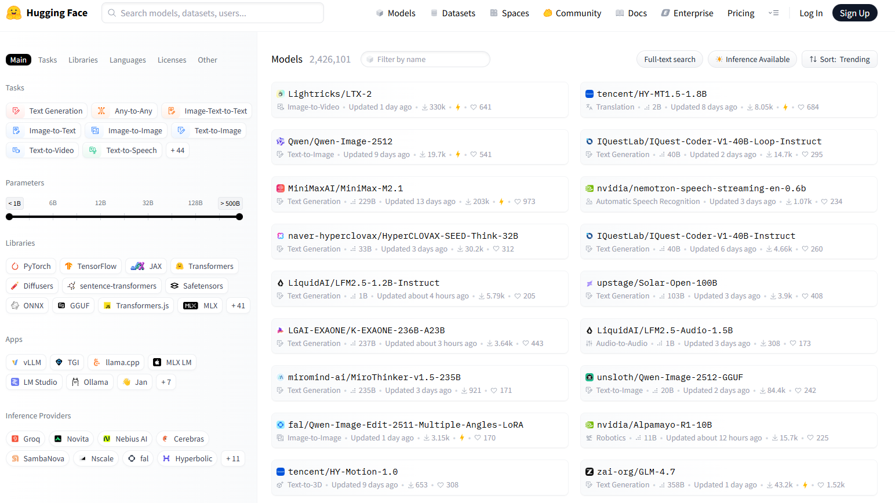
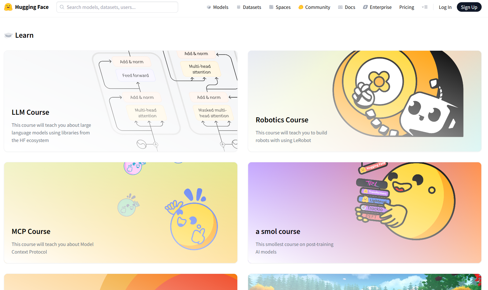
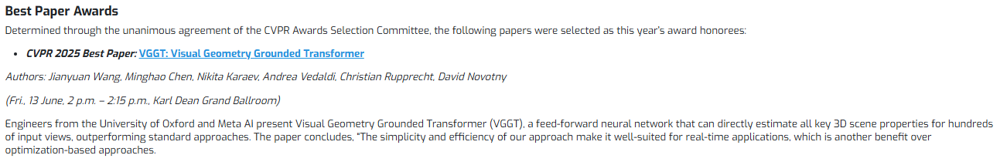
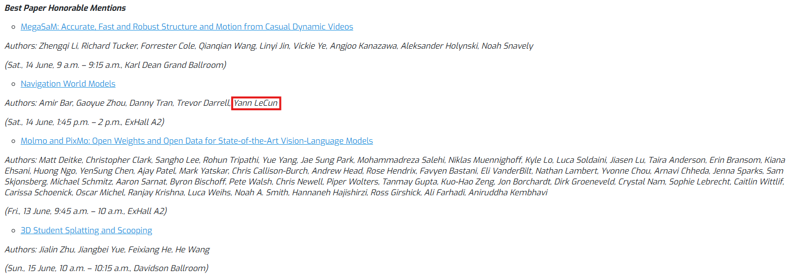
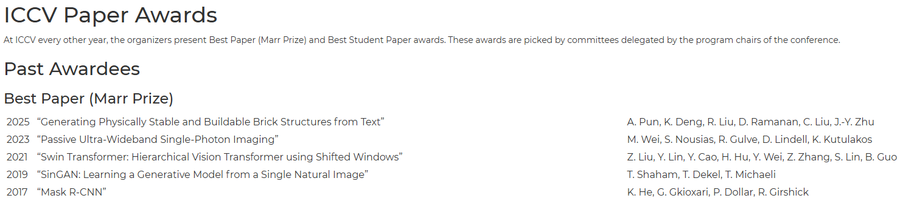

## 서문: 2년간의 공백
최근 2년 간 3D 스캐너를 개발해 왔습니다. 엄청나게 빠른 속도로 기술이 발전해가고 있는 요즘, 학계의 관심은 2D에서 3D로 점점 옮겨가고 있는 것 같습니다. 요즘에는 이미지 한 장만 넣으면 3D로 만들어주는 기술도 연구되고 있다고 하던데,, 제대로 공부해 볼 수 있는 시간이 없었다고 하면 핑계겠죠ㅠㅠ 스캐너는 실제 환경과 기하학적으로 완전히 동일한 데이터를 출력해 줄 수 있어야 하는 제품입니다. MRI로 뇌를 찍었는데 있지도 않은 종양이 보인다던가, 카메라로 셀카를 찍었는데 눈이 실제보다 크게 나오는 것처럼 거짓된 데이터를 출력하면 그 의미와 가치가 없어지는 제품이기 때문입니다. 오로지 수학적으로 정확하게 계산될 수 있는 값만 '실제 값'이라고 확신할 수 있기에, 인공지능을 통한 예측이 추가적인 도움을 줄 수는 있어도 기반이 되어서는 안 되기 때문입니다.

최근 들어 제품이 어느 정도 안정화되기 시작하면서 정신을 차려보니 최신 동향과는 조금 멀어진 제 자신이 보이더라고요. 그래서 연말 연초의 어수선한 분위기를 틈타 컴퓨터 비전 관련 최신 동향을 조금이나마 확인해보았습니다.

* * *

## 변화 1: Hugging Face

Papers with Code 서비스 중단,,?

최신 동향을 확인하기 위해 가장 먼저 했던 일은 항상 그래왔듯 **Papers with Code**에 들어가는 것이었습니다. 어떤 Task들이 학계의 가장 큰 관심 대상이고, 어떤 모델들이 벤치마크에서 상위를 차지하고 있는지 빠르게 훑어볼 수 있으니까요. 그런데 서비스가 중단되었다고 뜨더라고요. 연구에 뒤처질 것은 예상했지만, 이건 뭔가 세대 차이가 나는 느낌이랄까요ㅠㅠ 빠르게 변화하는 현대 사회를 이렇게 또 느끼게 되었네요 ㅎㅎ

아무튼 몇몇 글들을 찾아보니 Papers with Code는 서비스가 종료되고, **Hugging Face**라는 웹 사이트가 그 역할을 물려받게 되었다는 것을 알게 되었습니다. 개인적으로 느끼기에 Papers with Code에 비해 다소 복잡하다고 느껴지는 건 아마 적응의 시간이 필요한 거겠죠..?

Hugging Face > Models 탭

Hugging Face 홈페이지 구경을 조금 해봤는데, Papers with Code보다 넓은 분야의 모델들을 더 쉽게 공유할 수 있는 게 장점인 것처럼 보였습니다. 뭔가 Git 레포지토리를 찾는 것과 비슷한 느낌이었습니다. 그리고 이 화면에서 원하는 Task를 선택한 후, Trending이나 Most Likes를 기준으로 정렬하면 해당 Task에서 인기가 많은 모델들을 확인할 수 있었습니다. 하지만 이전에 Papers with Code와 같이 벤치마크를 통해 직관적으로 보기는 어려운 것 같습니다. 모델을 하나 선택해서 들어가면 성능을 확인할 수 있는 경우도 있지만 그렇지 않은 경우도 있고, 어떤 하나의 기준으로 순위를 나열해 놓은 게 아니라서 한눈에 안 들어오네요.. 적응이 되면 괜찮아지겠죠??

Hugging Face > Community > Learn

그럼에도 한 가지 마음에 들었던 부분은 **Learn**이라는 페이지였습니다. 이 페이지에서는 컴퓨터 비전, 로보틱스, 강화학습 등 다양한 분야에 대한 자료가 있었습니다. 전문가 분들이 챕터를 나눠 담당해서 그런지, 생각보다 깊이 있고 질 좋은 내용들을 접할 수 있었습니다. 컴퓨터 비전과 3D를 위한 머신러닝이라는 코스가 있던데, 저의 \[Vision-Flow\] 시리즈를 작성할 때에도 많이 참고해야 할 것 같습니다 ㅎㅎ

* * *

## 변화 2: 2D에서 3D로
세상에는 수많은 훌륭한 학회들이 있지만 현실적으로 모두 확인할 수는 없으니..! 컴퓨터 비전 분야에서 **Top-Tier** 학회라고 알려진 **CVPR, ICCV, ECCV, SIGGRAPH**의 Best Paper로 선정된 연구들 정도만 빠르게 확인해 보았습니다.  
(맨 아래 참고 자료에 보시면 링크 있습니다. **ICLR, ICML, NeurIPS**도 링크 걸어뒀습니다!)

CVPR 2025 Best Paper (VGGT: Visual Geometry Grounded Transformer)

CVPR 2025 Honorable Mentsions; Yann LeCun 아저씨는 아직도 활발하시네요 (찾아보니 65세이시던데 대단한 것 같습니다..)

CVPR 2025 수상 연구들을 둘러보다가 반가운 이름을 발견했습니다. **Yann LeCun** 교수님은 현재 뉴욕 대학교 교수이자 AMI Labs라는 회사를 설립하여 CEO로 계신다고 하네요. Meta에서 수석 AI 과학자 부사장으로 계시다 최근에 창업을 하신 걸로 보입니다. 컴퓨터 관련 전공자라면 누구나 들어보셨을 것 같은데요, 컴퓨터 비전 분야의 선구자라고 불리면서 그 공로를 인정받아 2018년에 튜링상을 수상하신 분입니다. 아마 제 계획이 크게 틀어지지 않는 이상 2주 안에 이 분이 왜 컴퓨터 비전의 선구자라고 불렸는지에 대해 소개하게 될 것 같습니다. 이번 CVPR 2025에서 Honorable Mention으로 선정된 논문 역시 아주 흥미로운 주제였는데요, 이 역시 다음번에 소개할 기회가 있으면 좋겠네요.

ICCV Best Paper Awards

2023년도까지만 해도 Top-Tier 학회에 쏟아지는 대부분의 논문들이 2D Task였고, 그러다 보니 Best Paper도 2D Task에 관한 연구들이 싹쓸이하는 분위기였는데, 2024년 이후부터 Best Paper 목록에 3D Task가 하나 둘 등장하는 걸 보니 확실히 이전에 비해 3D 환경을 이해하기 위한 연구들이 활발해진 것 같습니다. 부족하지만 제 관점에서 최신 동향을 요약하자면,

1.  Generative 3D (존재하지 않는 데이터의 **창조**): Text-to-3D, Image-to-3D, 3D Diffusion Model 등
2.  Reconstruction & Rendering (실존 물체 혹은 공간의 디지털로의 **복제**): NeRF, 3D Gaussian Splatting, Novel View Synthesis 등
3.  3D Scene Understanding (공간 **이해**): Monocular Depth Estimation, 3D Semantic Segmentation, 6D Pose Estimation 등
4.  Embodied AI (실제 3D 공간과의 **상호작용**): Visual SLAM, Vision-Language-Action(VLA) 모델 등

크게 이 정도의 연구들이 현재 활발히 진행 중이거나 앞으로 더 활발해질 주제들인 것 같습니다.

* * *

## 마무리
10여 년 전부터 빠르게 발전해 온 2D Task들이 많이 상용화되고 있고, 이에 따라 학계 혹은 대형 연구소에서는 3D Task로 관심을 옮기면서 또 한 번의 새로운 혁신을 준비하고 있는 것 같네요. 앞으로 상당히 긴 기간 동안 **컴퓨터 비전의 시작**부터 **인공지능의 발전**, 그리고 **2D Task**에서 **3D Task**까지, 전체적인 흐름을 한 번 짚어보고 싶습니다. 특히, 수식을 싫어하는 사람으로서 ([블로그 소개글](https://jyyun1209.tistory.com/notice/30) 참고) 수학적인 원리나 하나의 연구에 매몰되기보다 전체적인 맥락에서 어떤 문제를 어떻게 기가 막힌 아이디어로 해결하면서 발전해 왔는지 설명해 보겠습니다.

긴 글 읽어주셔서 감사합니다!

* * *

## 참고 자료
\[1\] [https://huggingface.co/](https://huggingface.co/)  
\[2\] [https://www.reddit.com/r/computervision/comments/1mivah8/what\_happened\_to\_paperswithcode\_redirects\_to/](https://www.reddit.com/r/computervision/comments/1mivah8/what_happened_to_paperswithcode_redirects_to/)  
\[3\] [https://blog.tib.eu/2025/10/02/papers-with-code-went-offline-the-knowledge-doesnt-have-to/](https://blog.tib.eu/2025/10/02/papers-with-code-went-offline-the-knowledge-doesnt-have-to/)  
\[2\] [https://en.wikipedia.org/wiki/Yann\_LeCun](https://en.wikipedia.org/wiki/Yann_LeCun)  
\[3\] [http://yann.lecun.com/](http://yann.lecun.com/)  

**Top-Tier 학회 Best Paper Awards 리스트  
**\[1\] CVPR2025 Paper Awards: [https://cvpr.thecvf.com/Conferences/2025/News/Awards\_Press](https://cvpr.thecvf.com/Conferences/2025/News/Awards_Press)  
\[2\] ICCV Paper Awards: [https://tc.computer.org/tcpami/](https://tc.computer.org/tcpami/)  
\[3\] ECCV2024 Paper Awards: [https://eccv.ecva.net/Conferences/2024/Awards](https://eccv.ecva.net/Conferences/2024/Awards)  
\[4\] SIGGRAPH2025 Paper Awards: [https://blog.siggraph.org/2025/06/siggraph-2025-technical-papers-awards-best-papers-honorable-mentions-and-test-of-time.html/](https://blog.siggraph.org/2025/06/siggraph-2025-technical-papers-awards-best-papers-honorable-mentions-and-test-of-time.html/)  
\[5\] ICLR2025 Outstanding Paper Awards: [https://blog.iclr.cc/2025/04/22/announcing-the-outstanding-paper-awards-at-iclr-2025/](https://blog.iclr.cc/2025/04/22/announcing-the-outstanding-paper-awards-at-iclr-2025/)  
\[6\] ICML2025 Awards: [https://icml.cc/virtual/2025/awards\_detail](https://icml.cc/virtual/2025/awards_detail)  
\[7\] NeurIPS2025 Awards: [https://neurips.cc/virtual/2025/awards\_detail](https://neurips.cc/virtual/2025/awards_detail)
