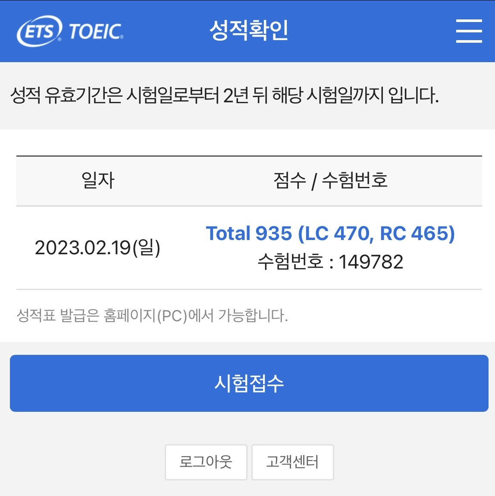
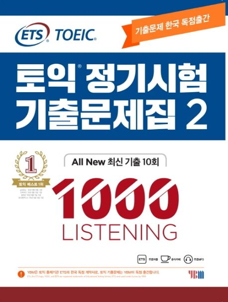
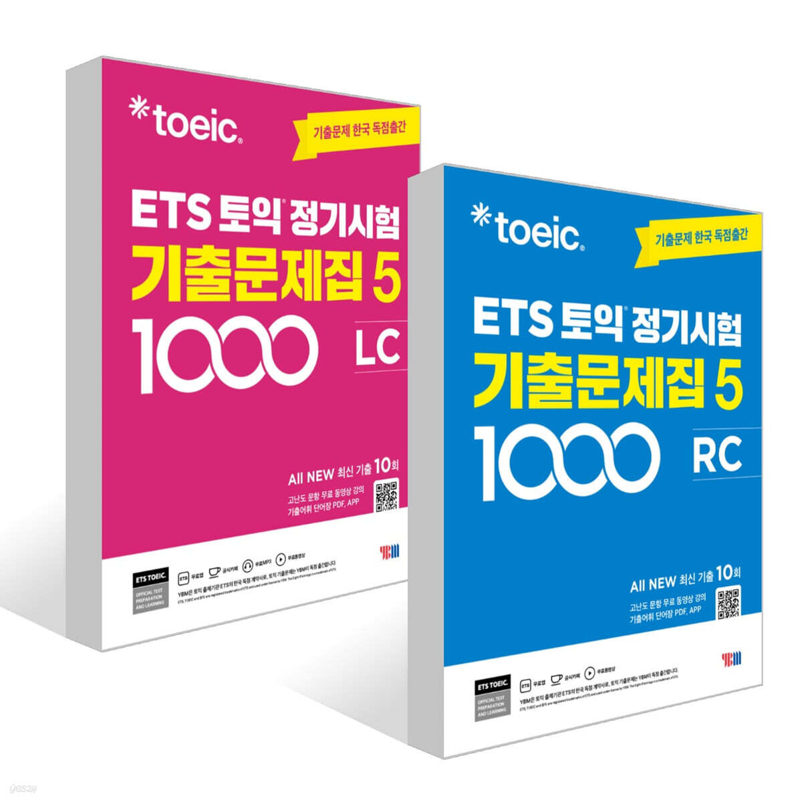

\*좀 더 간략하게 정리된 글을 보고 싶으신 분들은 아래 링크에서 확인하실 수 있습니다.  
([https://jyyun1209.tistory.com/25)](https://jyyun1209.tistory.com/25)

## Intro.
2년 전쯤 토익 꿀팁 관련 글을 작성했었는데, 기존 글이 너무 간단하게 작성했던 것 같기도 하고, 토익 시험을 다시 칠 때가 돼서 다시 정리하면서 리마인드 해보려 합니다! 당시에 시험 준비를 딱 일주일 밖에 안 했어서 성적을 보자마자 정말 깜짝 놀랐었던 기억이 있습니다. 토익은 운빨이라는 사람들도 많던데, 아마 저도 그런 케이스이지 않을까 싶기도 합니다. 하지만 운도 실력이라는 말이 있듯, 전략적으로 접근하면 그 확률을 조금이라도 올릴 수 있지 않을까요??

2년 전 토익 성적 확인 창

저는 이과이고, 과학고등학교를 졸업해서 중학교 이후로는 영어를 제대로 공부하지 못했지만, **반복되는 패턴**을 파악하고, **시간을 단축**할 수 있는 방법들을 고민하다 보니 빠르게 성적을 올릴 수 있었던 것 같습니다. 사실 토익은 만점이 990점이기 때문에 935점이면 아주 고득점이라고 보기는 어렵지만, 900점을 넘기는 게 목표이신 분들에게는 이 글이 조금이나마 도움이 될 수 있지 않을까 생각해 봅니다!

* * *

## 준비물
**1\. ETS 토익 정기시험 기출문제집**

다양한 문제집들이 있었지만, 저는 '토익 정기시험 기출문제집'으로 준비를 했습니다. 당시에 1, 2, 3권이 있었고, 난이도 순이겠지 하고 적당히 2권을 골랐는데, 나중에 알고 보니 숫자가 높을수록 최신 경향을 더 반영하는 것 같더라고요. 최근에는 5권까지 나온 것 같아서 아마도 5권을 사서 준비하면 되지 않을까.. 싶습니다.

당시 사용했던 2권과 최근 출시한 것으로 보이는 5권

**2\. 심이 두꺼운 연필, 지우개**

토익 시험은 OMR 카드에 마킹을 해야 하는데, 뭐 얼마나 차이가 나겠냐고 하시는 분들도 계시지만 연필을 사용하는 것이 샤프나 볼펜보다 확연히 마킹하는 속도가 빠른 것 같습니다. 심이 잘 부러지지는 않지만, 만일을 대비해 **심이 두꺼운 연필로 2, 3개 정도** 챙겨가는 것을 강력히 추천드립니다!

* * *

## 문제 푸는 순서 / 시간 분배
문제 푸는 '**속도'**는 사람, 컨디션이나 난이도, 상황에 따라 달라질 수 있습니다. 하지만 문제를 푸는 '**순서'**는 정확하게 정해놓고, 습관이 될 수 있도록 반복 연습하는 것이 좋다고 생각합니다. 정리된 규칙이 있어야 시험장에서는 오로지 문제를 푸는 데에만 집중할 수 있기 때문입니다. 하지만 너무 빡빡한 기준에 본인을 맞추려 하다 보면 스트레스만 받고, 오히려 과한 긴장감을 유발할 수 있는 것 같습니다. 그러니 본인의 페이스에 맞게 결정하되, **너무 강박을 가지지 않는 게 중요**하다고 생각합니다. 아래는 제가 풀이하는 방식인데, 참고하시면 좋을 것 같습니다. 참고로 제가 푸는 방식의 기본 전제는 어떤 Part를 풀이하는 동안에는 **해당 Part에만 집중**하는 것입니다. (그래서 Part 5를 미리 푸는 시간을 제외하고는 전부 파트 순서대로 풀이합니다.)

**1\. Part 5를 미리 푸는 시간: LC 시작부터 Part 1 디렉션 시간과 Part 2 디렉션 시간에만!**

LC가 시작하고 Part 1의 디렉션이 끝날 때까지의 시간과 Part 2의 디렉션이 나오는 동안에는 **Part 5 문제를 한 페이지 반 정도 (109~114번)까지** 푸는 것을 목표로 합니다. 

Part 1이나 Part 2를 풀이하는 중간에도 RC를 푸는 분들이 계시던데, 대단한 것 같습니다.. 저는 그렇게 했을 때 오히려 LC에서 하나씩 실수하는 경우가 생기는 것 같더라고요. LC 중에서도 특히 Part 1, 2는 실수가 없이 깔끔해야 하는데, 혹시나 시작부터 껄끄럽게 넘어가면 다른 파트를 풀 때 계속 신경이 쓰여서 전체적인 컨디션이 저하되는 느낌이었습니다.

추가로, **Part 3, 4의 디렉션**은 Part 1, 2 디렉션에 비해 짧아서, Part 5를 풀기보다, 각 파트의 **첫 세 문제의 보기를 미리 읽고 내용을 유추**하고 있는 것이 좋은 것 같습니다. (뒤에 LC 풀이법 설명 참고 부탁드립니다!)

**2\. Part 5, 6은 최대한 빠르게, 나머지 시간은 Part 7에 투자**

시험을 칠 때에는 계속 시계를 보거나, 시간을 재면서 하기보다, **Part 5, 6은 최대한 빠르게** 풀어버리고, **나머지 모든 시간을 Part 7에 투자**한다고 생각하는 게 편한 것 같습니다. Part 5, 6을 푸는데, 목표하는 시간이 지났다고 해서 문제를 안 풀고 넘어갈 것도 아니기 때문에, 충분히 많은 연습을 통해 최대한 시간을 단축해 놓고 시험장에서는 자신을 믿는 것이 좋습니다. 저 같은 경우에는

**Part 5, 6을 합쳐서 16분 이하, Part 7에 55분 이상**

을 목표로 연습했습니다. 즉, Part 5, 6을 아무리 늦어도 16분 안에는 모두 풀 수 있도록, 그리고 나머지 시간에는 Part 7을 모두 풀어낼 수 있도록 연습했습니다. 제 생각에 RC에서 단기간에 시간을 가장 많이 단축할 수 있는 파트는 Part 5, 6이라고 생각합니다.

* * *

## LC 문제 풀이 팁
**0\. LC 연습 시, 기본적인 마인드셋**

실제 시험장에서는 스피커가 안 좋거나, 옆 사람이 기침을 하는 등 다양한 이유로 잘 안 들리는 경우가 많습니다. 그렇기 때문에 연습 시에는 **최대한 실제 시험장에서와 비슷하게**, 잘 안들리거나 문제가 생기더라도 넘어갑니다. 그러면 자연스럽게 잘 못 들은 경우에도 문제를 맞힐 수 있는 연습이 될 뿐 아니라, 본인의 페이스를 잃지 않을 수 있습니다.

리스닝 시험은 본인이 페이스를 조절하는 것이 아니라, 문제가 시험의 페이스를 조절하기 때문에 한 번 페이스를 놓치면 따라잡기 힘듭니다. 그래서 위에서 말씀드린 것과 같이 잘 안 들렸을 때를 대비하여 준비해 놓으면, 앞 문제를 틀린 것 같아도 **개의치 않고 다음 문제에 집중하는 연습**을 할 수 있습니다. 저는 시험장에서 옆 사람이 기침했을 때, 제대로 못 들었지만 풀 수 있었고, 기분이 나쁘기보다, 오히려 '내가 이때를 위해 준비했지'와 같이 생각하면서 속으로 뿌듯해했던 기억이 있습니다.

**1\. Part 1, 2**

Part 1, 2는 객관적으로 난도가 높지 않기 때문에, **실수를 하지 않는 것**이 가장 중요합니다. 문제의 특성상, 문제를 꼬아서 출제할 방법이 유사한 단어를 통한 말장난 뿐입니다. 따라서 **유사한 발음이나 의미의 단어가 나오는 보기에 흔들리지 않게 연습**하면 됩니다. 유사한 단어로 말장난을 하는지 아닌지만 유의하면서 들으면 크게 문제없을 거라고 생각합니다.

Part 2의 경우에는 짧은 문장에 대한 답을 선택하는 문제 유형이기 때문에, 질문의 첫 번째 몇 단어가 많이 중요합니다. 문장의 모든 의미를 제대로 들으면 베스트고, 그렇지 못하더라도 What is, Where is, Who is 등 **문장의 시작을 집중해서 들어놓고, 그에 맞는 답을 선택**하면 됩니다. What is ~~ 라고 질문한 경우에 사람 이름이 정답일 가능성은 아무래도.. 희박하겠죠!

오답 개수의 경우, **Part 1, 2를 합쳐 2개 이하로 틀리도록 연습**했습니다.

**2\. Part 3, 4**

Part 3, 4는 기본적으로 화자가 말을 하면서 첫 번째 문제에 대한 답, 두 번째 문제에 대한 답이 **말하는** **순서대로** 나오기 때문에, 화자가 말하는 것을 따라가면서 문제를 풀면 됩니다. 그래서 제가 \[문제 푸는 순서 / 시간 분배\]에서 말씀드린 것과 같이, 화자가 말을 시작하기 전에 문제의 보기를 훑어보면서 어떤 주제, 어떤 흐름으로 말을 하겠구나 하는 것을 대충 파악해 놓는 것이 정말 큰 도움이 됩니다.

오답 개수의 경우, **Part 3, 4를 합쳐 3개 이하로 틀리도록 연습**했습니다.

* * *

## RC 문제 풀이 팁
\*RC의 경우, 말로만 전달했을 때 이해가 어려운 부분들이 있어서, 예시를 섞어서 설명해 드리도록 하겠습니다.

**1\. Part 5, 6**

Part 5, 6은 빈칸 채우기 문제이기 때문에, 시간을 줄이기 위해서 무조건 빈칸 주변만 읽는 사람도 있습니다. 하지만 저는 완전 확신이 드는 것이 아니면 웬만해서는 처음부터 끝까지 읽고 넘어가는 것을 추천드립니다. 왜냐하면 간혹 문장을 전부 읽었을 때 답이 달라지는 경우가 있기 때문입니다. (하지만 거의 대부분 문제의 경우 확신이 들도록 연습해야 하는 것은 맞습니다.) 아래의 문제로 예를 들어 드리겠습니다.

> **Ms. Choi would have been at the keynote address if her train \[   \] on time.**  
> (A) arrives  
> (B) will arrive  
> (C) had arrived  
> (D) arriving

위 문제를 빨리 풀기 위해서 if 뒷부분만 읽으면, 미래의 일 같아서 (A) arrives를 정답이라고 할 것입니다. 하지만 앞에서부터 읽어보면, would have been 때문에 (C) had arrived가 더 적합하다는 것을 알 수 있습니다. 그래서 제가 추천드리는 방법은, **정****답을 찾는 것이 아니라, 틀린 보기를 찾는 것**입니다. 문장의 일부만 읽었음에도 말이 되는 보기가 하나 밖에 안 남으면 바로 정답을 체크하면 되지만, 그렇지 않으면 앞 문장을 읽어보는 방식입니다. 다른 것도 답이 될 수 있다는 열린 가능성 안에서 정답을 찾는 것보다, 확실하게 오답인 것을 찾는 것이 정확도와 속도 모두를 잡는 방법이라고 생각하고 있습니다.

**2\. Part 7**

Part 7은 기본적으로 지문의 길이가 길기 때문에, 잘못하면 시간이 정말 많이 소요됩니다. 그래서 **Part 7에서 지문은 절대로 다 읽지 않습니다.** 먼저 Part 7의 대다수 문제는 LC의 Part 3, 4처럼 지문에 **서술된 순서대로 문제가 출제**되는 것 같습니다. 그래서 이전 문제의 정답을 찾았다면, 다음 문제의 정답은 높은 확률로 그보다 더 뒤에서 찾을 수 있습니다.

Part 7 뒷부분으로 가면 지문이 3개, 문제가 5개인 경우를 찾아볼 수 있는데, 이런 경우에는 **두 개 이상의 지문 내용을 모두 다 알고 있어야 풀 수 있는 문제가 적어도 한 개는 무조건 나오는 경향**이 있습니다. 그렇기 때문에 지문이 3개가 나왔다 하면 이 점을 인지하면서 읽으면 좋습니다. 예를 들어, 3개의 지문이 아래의 예시처럼 구성된 문제에서, 지문 1과 2를 읽으면서 '아, 지문 3을 통해 어떤 자동차를 빌릴지 선택하게 되겠구나'와 같이 생각할 수 있어야 합니다. 이렇게 생각하면 아무래도 지문 1과 2를 읽으면서 자동차를 선택하는데 필요한 것들을 좀 더 집중해서 볼 수 있게 됩니다. 

> 지문 1: 회사 상사와의 출장 예산과 관련된 질문을 하는 메일  
> 지문 2: 출장과 관련된 메신저 대화 내용  
> 지문 3: 렌터카 가격표

이 점을 미리 생각하지 않고 있다가 문제를 마주하면, 지문을 여러 번 다시 읽고, 필요한 부분을 찾으면서 시간을 배로 사용하게 되는 경우가 생기기 때문에 꼭 연습하면 좋습니다.

* * *

## 단어 암기
한국어 중에서도 모르는 단어가 있는데, 당연히 모든 단어를 알 수 없습니다. 하지만 **Part 5에서 보기로 자주 등장하는 단어**는 거의 알고 있도록 연습해야 합니다. 아래에서 언급할 **\[산타 토익\]**이 정말 많은 도움이 됐는데, 특히 Part 5 형용사, 동사 편이 많이 도움 됐습니다. 시험 며칠 전부터 이것만 계속하면서 자주 나오는 단어들을 써놓고 외우면 됩니다.

Part 6, 7의 지문 내용 중에서 모르는 단어가 있는 경우가 많을 텐데, 굳이 엄청 노력해서 외우려고 할 필요는 없는 것 같습니다. 어차피 지문이 바뀔 때마다 모르는 단어가 계속 등장하기 때문에, **짧은 시간 안에 시험장에서 모르는 단어가 없도록 하는 일은 불가능**합니다. 그렇기 때문에 적당히 맥락을 이해하는 선에서 필요하다면 의미를 유추하고, 그렇게 7, 80% 정도로 지문을 이해한 상태에서 정답을 맞힐 수 있으면 되는 것 같습니다. 다만, **비즈니스와 관련된 것 같다 싶은 단어는 유심히 보는 정도**로 하면 좋은 것 같습니다.

* * *

## 산타 토익
저는 파워 블로거도 아니기 때문에.. 당연히 산타 토익을 광고하는 글이 아닙니다. (무언가를 광고할 수 있는 정도의 사람이 되면 멋있을 것 같습니다.) 아무튼 그렇기 때문에 저는 유료로 산타 토익을 쓰라고 말씀드리는 것이 아닙니다!! 산타 토익은 처음 가입하면 3 일간 무료 체험이 가능하기 때문에, 시험일 3, 4일 전에 가입해서 본인이 **자주 틀리거나, 속도가 느리다고 생각되는 파트만 주구장창** 하면 됩니다.

앞서 \[문제 푸는 순서 / 시간 분배\]에서 설명드린 것과 같이, Part 5, 6의 시간을 최대한 단축하기 위해 한 것이 바로 산타 토익이었습니다. 저는 자주 틀리는 문제 유형만 선택해서 **틀리는 것에 개의치 않고, 기계적으로 계속 풀었습**니다. 그러면서 문제는 다르더라도 반복적으로 나오는 단어들이 있으면 적어놓고 외우면서 단어 암기도 한 번에 해결했습니다.

또한, 산타 예상 점수를 계속 볼 수 있는데, 제대로 공부만 했다면 예상 점수와 크게 다르지 않게 점수를 받을 수 있습니다. 저도 산타 예상 점수 900을 목표로 게임처럼 했고, 시험 전날 밤에 딱 900점을 만들고 잤습니다.

* * *

## 마무리
이전 글이 너무 간단 요약 느낌이라 다시 작성했는데, 쓰다 보니 이 글은 너무 길어져서 혹시 읽기 어렵지 않으실까 걱정이 되네요ㅠㅠ 하지만 저는 확실히 리마인드가 된 것 같아서, 이번에 토익을 준비함에 있어서 도움이 될 것 같습니다. 여러분에게도 이 글이 도움이 되었으면 좋겠고, 토익 준비하시는 모두들 목표 점수 받을 수 있으시길 기원합니다!!

긴 글 읽어주셔서 감사합니다 :)
